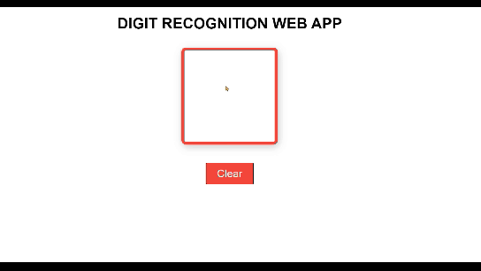

Here’s a simplified and clean README for your project:

---

# **Digit Recognizer**

This is a simple project that demonstrates handwritten digit recognition using a Convolutional Neural Network (CNN). The web-based interface lets users draw digits on a canvas and see real-time predictions.

---

## **Live Demo**
🌐 Try it here: [Digit Recognizer](https://MustafaAhmadov.github.io/digit-recognizer/canvas.html)

---

## **Features**
- Draw digits (0–9) on an interactive canvas.
- Get real-time predictions powered by a trained CNN model.
- Simple and easy-to-use interface.

---

## **How to Run Locally**
1. Clone this repository:
   ```bash
   git clone https://github.com/MustafaAhmadov/digit-recognizer.git
   cd digit-recognizer
   ```

2. Start a local server:
   ```bash
   python -m http.server 8080
   ```

3. Open your browser and go to:  
   [http://localhost:8080](http://localhost:8080)

---

## **Project Files**
- **`canvas.html`**: Main HTML file for the demo.
- **`preview.gif`**: A preview of the project in action.
- **`model/`**: Contains the trained model (optional if used for predictions).
- **`notebooks/`**: Code used to train the CNN model.

---

## **Preview**


---

## **License**
This project is licensed under the [MIT License](LICENSE).
